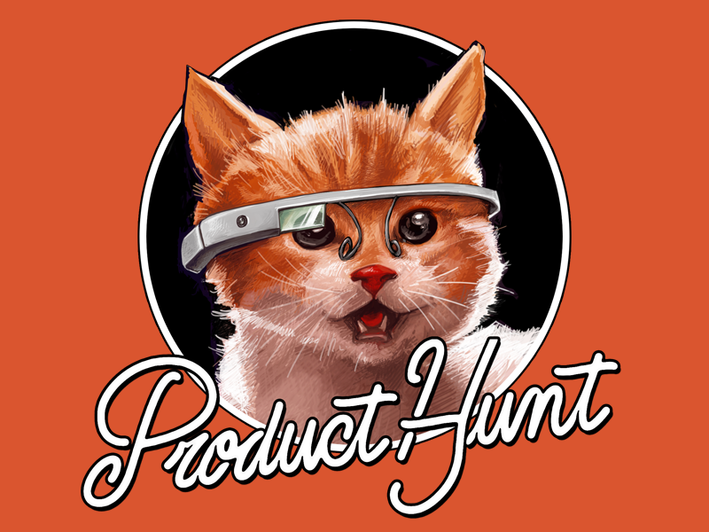
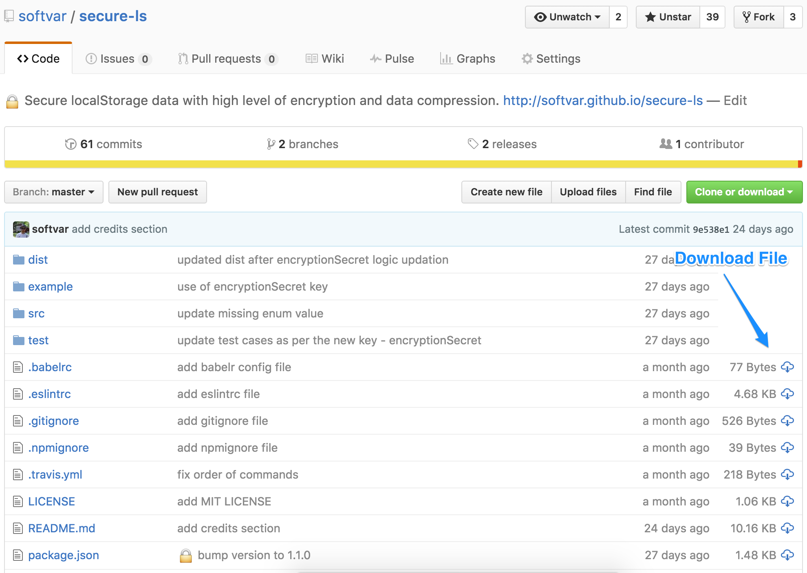

##  Github Plus - A useful Chrome Extension

## Link

🚀 Install extension from [Chrome Web Store](https://chrome.google.com/webstore/detail/github-pluse/anlikcnbgdeidpacdbdljnabclhahhmd)

## Features

* Automatically displays each file size for every active branch (not applicable for folder / symlink).
* Show download link for each individual file (not applicable for folder / symlink).
* Copy file's contents directly to Clipboard (just won't work for markdown files).
* Download file while viewing it's contents.

***Note:*** For private repos, Github Access Token is requires. Follow the steps [mentioned below](#github-api-rate-limiting) to add your Github Access Token.

[Featured on ProductHunt](https://www.producthunt.com/tech/github-plus)

## Author

| Author | [Varun Malhotra](http://varunmalhotra.xyz) |
|--------|--------------------------------------------|

## Github API Rate Limiting

Since this extension fetches data using Github public v3 API for showing file *size* and *download_url*, it consumes free quota which is very less [Github API Rate Limiting](https://developer.github.com/v3/rate_limit/).

To tackle this, create a new Github Access Token.

1. If logged-in, visit [https://github.com/settings/tokens](https://github.com/settings/tokens)
2. Generate a new token, select `repo` scope and create a one.
3. Copy and store the generated token which looks something like: `17c1a8d5b399d66b6212382d98d4c67a94d58955` (a fake one :P).
4. Click on extension icon and then on `Settings-Options` on top right.
	

	OR

	Go to [chrome://extensions](http://chrome://extensions), find github-plus and click on `Options`.

	
	

5. Enter the valid Github Access Token
6. Click on `SAVE` and Enjoy the benefits.

This Chrome extension will automatically pick this valid access token and Bingo!

## Screenshots

#### Screenshot of each file size and it's download link

#### Screenshot of Copy fle contents and download link

## Libraries Used

* Thanks to [@zenorocha](https://github.com/zenorocha/) for [Clipboard.js](https://github.com/zenorocha/clipboard.js) - Modern copy to clipboard. No Flash. Just 3kb gzipped.

## Development

1. Clone this repo
2. Run `gulp` for generating packaged folder specifically for extension stuff.
2. Go to chrome extensions [chrome://extensions](chrome://extensions)
3. Enable developer mode
5. Click on load unpacked extension and select the generated folder.
6. [Admin Access Only] - run `gulp zip` for generating zip file to be uploaded on *Chrome Web Store*.

PRs are most welcome :)

## Copyright and License

>The [MIT license](https://opensource.org/licenses/MIT) (MIT)
>
>Copyright (c) 2016 Varun Malhotra
>
>Permission is hereby granted, free of charge, to any person obtaining a copy of this software and associated documentation files (the "Software"), to deal in the Software without restriction, including without limitation the rights to use, copy, modify, merge, publish, distribute, sublicense, and/or sell copies of the Software, and to permit persons to whom the Software is furnished to do so, subject to the following conditions:
>
>The above copyright notice and this permission notice shall be included in all copies or substantial portions of the Software.
>
>THE SOFTWARE IS PROVIDED "AS IS", WITHOUT WARRANTY OF ANY KIND, EXPRESS OR IMPLIED, INCLUDING BUT NOT LIMITED TO THE WARRANTIES OF MERCHANTABILITY, FITNESS FOR A PARTICULAR PURPOSE AND NONINFRINGEMENT. IN NO EVENT SHALL THE AUTHORS OR COPYRIGHT HOLDERS BE LIABLE FOR ANY CLAIM, DAMAGES OR OTHER LIABILITY, WHETHER IN AN ACTION OF CONTRACT, TORT OR OTHERWISE, ARISING FROM, OUT OF OR IN CONNECTION WITH THE SOFTWARE OR THE USE OR OTHER DEALINGS IN THE SOFTWARE.
