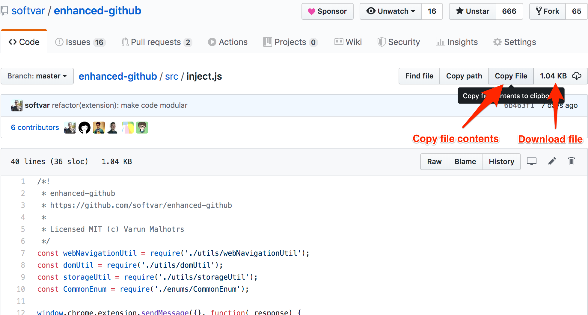

##  Enhanced GitHub

> Browser extension that adds useful features on GitHub website

 

[][chrome]
[][chrome]

[][firefox]
[][firefox]

[][edge]

## Supported Browsers

 Install extension from [Chrome Web Store][chrome]

 Install add-on from [Firefox Add-ons][firefox]

 Install extension from [Microsoft Edge Add-ons][edge]

## Website

[Home](https://varunmalhotra.xyz/enhanced-github/)

## Features

- Displays repo size.
- Displays each file size for every active branch (not applicable for folder / symlink).
- Show download link for each file (not applicable for folder / symlink).
- Copy file's contents directly to Clipboard (just won't work for markdown files).
- Download file while viewing its contents.

The extension handles the SPA behavior of GitHub website from `v3.0.0` onwards :)

**_Note:_** For private repos([Issue #6](https://github.com/softvar/enhanced-github/issues/6)), GitHub Access Token is required. Follow the steps [mentioned below](#github-api-rate-limiting) to add your GitHub Access Token.

### Permissions required

- `"*://*.github.com/*"` - for running on `github.com` domain.
- `storage` - for storing GitHub access token on your local system. GitHub Access token is required for private repos and for handling API rate-limiting issues.
- `webRequest` - to support GitHub being a single-page-application now. Read this [detailed blog](https://medium.com/@softvar/making-chrome-extension-smart-by-supporting-spa-websites-1f76593637e8).
- `webNavigation` - to support GitHub being a single-page-application now. Read this [detailed blog](https://medium.com/@softvar/making-chrome-extension-smart-by-supporting-spa-websites-1f76593637e8).

## Author

Varun Malhotra

## GitHub API Rate Limiting

Since this extension fetches data using GitHub public v3 API for showing file _size_ and _download_url_, it consumes free quota which is very less [GitHub API Rate Limiting](https://developer.github.com/v3/rate_limit/).

To tackle this, create a new GitHub Access Token.

1. If logged-in, visit [https://github.com/settings/tokens](https://github.com/settings/tokens)
2. Generate a new token, select `repo` scope and create a one.
3. Copy and store the generated token which looks something like: `17c1a8d5b399d66b6212382d98d4c67a94d58955` (a fake one :P).
4. Click on extension icon and then on `Settings-Options` on top right.
   

   OR

   Right-click on enhanced-github extension and click on `Options` in the dropdown menu.

   

5. Enter the valid GitHub Access Token
6. Click on `SAVE` and Enjoy the benefits.

This browser extension will automatically pick this valid access token and Bingo!

## Screenshots

### 2024 - Updated GitHub UI

#### Screenshot of each file size and it's download link

### New GitHub Design - [Blog](https://github.blog/changelog/2020-06-23-design-updates-to-repositories-and-github-ui/)

#### Screenshot of each file size and it's download link

#### Screenshot of Copy file contents and download link

### Old GitHub Design

#### Screenshot of each file size and it's download link

#### Screenshot of Copy fle contents and download link

## Libraries Used

- Thanks to [@zenorocha](https://github.com/zenorocha/) for [Clipboard.js](https://github.com/zenorocha/clipboard.js) - Modern copy to clipboard. No Flash. Just 3kb gzipped.

## Development

1. Clone this repo
2. Run `yarn dev` for generating packaged folder specifically for extension stuff.
3. Go to extension page. For chrome extensions [chrome://extensions](chrome://extensions), Firefox Add-ons [about:debugging](about:debugging), and Microsoft Edge Extensions [edge://extensions/](edge://extensions/).
4. Enable developer mode
5. Click on load unpacked extension and select the generated folder.
6. [Admin Access Only] - run `yarn build` for generating zip file to be uploaded on _Chrome Web Store_, _Firefox Add-ons_, and _Microsoft Edge Addons_.

PRs are most welcome :)

## Changelog

[CHANGELOG.md](https://github.com/softvar/enhanced-github/blob/master/CHANGELOG.md)

## Contributors

**Author:** [Varun Malhotra](https://varunmalhotra.xyz)([@softvar](https://github.com/softvar))

### Code Contributors

This project exists thanks to all the people who contribute. [[Contribute](CONTRIBUTING.md)].

### Financial Contributors

Become a financial contributor and help us sustain our community. [[Contribute](https://opencollective.com/enhanced-github/contribute)]

#### Individuals

#### Organizations

Support this project with your organization. Your logo will show up here with a link to your website. [[Contribute](https://opencollective.com/enhanced-github/contribute)]

## Policy

Refer [Privacy Policy](https://varunmalhotra.xyz/enhanced-github/#privacy-policy).

> Enhanced GitHub Extension doesn't collect/share/care about your data at all.
>
> Asks for GitHub Access Token for private repos and if Rate Limiting is your concern.

## Copyright and License

❗️ This extension is not sponsored by, endorsed by, or an official project of GitHub. This is a personal project and is developed solely for providing additional functionalities on GitHub website.

> The [MIT license](https://opensource.org/licenses/MIT) (MIT)
>
> Copyright (c) 2016-2024 Varun Malhotra
>
> Permission is hereby granted, free of charge, to any person obtaining a copy of this software and associated documentation files (the "Software"), to deal in the Software without restriction, including without limitation the rights to use, copy, modify, merge, publish, distribute, sublicense, and/or sell copies of the Software, and to permit persons to whom the Software is furnished to do so, subject to the following conditions:
>
> The above copyright notice and this permission notice shall be included in all copies or substantial portions of the Software.
>
> THE SOFTWARE IS PROVIDED "AS IS", WITHOUT WARRANTY OF ANY KIND, EXPRESS OR IMPLIED, INCLUDING BUT NOT LIMITED TO THE WARRANTIES OF MERCHANTABILITY, FITNESS FOR A PARTICULAR PURPOSE AND NONINFRINGEMENT. IN NO EVENT SHALL THE AUTHORS OR COPYRIGHT HOLDERS BE LIABLE FOR ANY CLAIM, DAMAGES OR OTHER LIABILITY, WHETHER IN AN ACTION OF CONTRACT, TORT OR OTHERWISE, ARISING FROM, OUT OF OR IN CONNECTION WITH THE SOFTWARE OR THE USE OR OTHER DEALINGS IN THE SOFTWARE.

<!-- Links -->

[chrome]: https://chrome.google.com/webstore/detail/enhanced-github/anlikcnbgdeidpacdbdljnabclhahhmd
[firefox]: https://addons.mozilla.org/en-US/firefox/addon/enhanced-github/
[edge]: https://microsoftedge.microsoft.com/addons/detail/enhanced-github/eibibhailjcnbpjmemmcaakcookdleon
