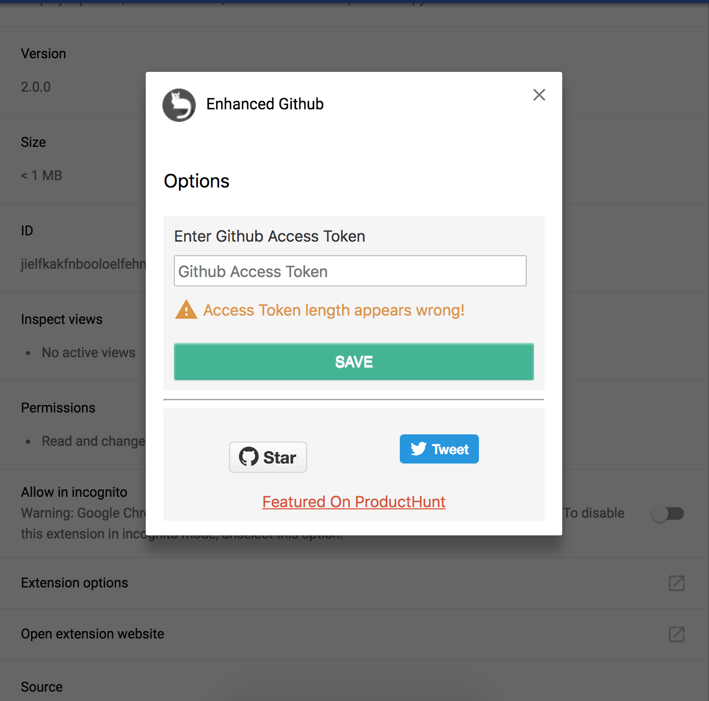

##  Enhanced GitHub

> Chrome extension that adds useful features on GitHub website

 

## Link

🚀 Install extension from [Chrome Web Store](https://chrome.google.com/webstore/detail/enhanced-github/anlikcnbgdeidpacdbdljnabclhahhmd)

## Features

- Displays repo size.
- Displays each file size for every active branch (not applicable for folder / symlink).
- Show download link for each individual file (not applicable for folder / symlink).
- Copy file's contents directly to Clipboard (just won't work for markdown files).
- Download file while viewing it's contents.

**_Note:_** For private repos([Issue #6](https://github.com/softvar/enhanced-github/issues/6)), GitHub Access Token is required. Follow the steps [mentioned below](#github-api-rate-limiting) to add your GitHub Access Token.

[Featured on ProductHunt](https://www.producthunt.com/tech/github-plus)

## Author

| Author | [Varun Malhotra](http://varunmalhotra.xyz) |
| ------ | ------------------------------------------ |

## GitHub API Rate Limiting

Since this extension fetches data using GitHub public v3 API for showing file _size_ and _download_url_, it consumes free quota which is very less [GitHub API Rate Limiting](https://developer.github.com/v3/rate_limit/).

To tackle this, create a new GitHub Access Token.

1. If logged-in, visit [https://github.com/settings/tokens](https://github.com/settings/tokens)
2. Generate a new token, select `repo` scope and create a one.
3. Copy and store the generated token which looks something like: `17c1a8d5b399d66b6212382d98d4c67a94d58955` (a fake one :P).
4. Click on extension icon and then on `Settings-Options` on top right.
   

   OR

   Right click on enhanced-github extension and and click on `Options` in the dropdown menu.

   

5. Enter the valid GitHub Access Token
6. Click on `SAVE` and Enjoy the benefits.

This Chrome extension will automatically pick this valid access token and Bingo!

## Screenshots

#### Screenshot of each file size and it's download link

#### Screenshot of Copy fle contents and download link

## Libraries Used

- Thanks to [@zenorocha](https://github.com/zenorocha/) for [Clipboard.js](https://github.com/zenorocha/clipboard.js) - Modern copy to clipboard. No Flash. Just 3kb gzipped.

## Development

1. Clone this repo
2. Run `gulp` for generating packaged folder specifically for extension stuff.
3. Go to chrome extensions [chrome://extensions](chrome://extensions)
4. Enable developer mode
5. Click on load unpacked extension and select the generated folder.
6. [Admin Access Only] - run `gulp zip` for generating zip file to be uploaded on _Chrome Web Store_.

PRs are most welcome :)

## Changelog

- **v0.1.1** _- 13th Aug, 2016_

		* Initial Launch

- **v0.1.2** _- 14th Aug, 2016_

		* Fix :: fix bug file on commits/<branch> url

- **v0.1.3** _- 14th Aug, 2016_

		* Fix :: fix focus effect on up-tree not removing blank td while navigating [#3](https://github.com/softvar/enhanced-github/pull/3)

- **v0.1.4** _- 20th Aug, 2016_

		* Improvement :: Better way of adding GitHub Access token - click extension or click options - Enhanced GitHub after opening *chrome://extension*

- **v0.1.5** _- 22nd Aug, 2016_

		* Feature :: Show repo size on GitHub's repo homepage
		* Fix :: bugfix of default branch other than **master**

- **v0.1.6** _- 27th Aug, 2016_

		* Fix :: not showing repo size when navigating back; fix no hash change detection

- **v0.1.7** _- 10th Mar, 2017_

		* Fix :: Add proper toggle class [github changed class names] which fixes flickering while hover
		* Fix :: Dont add `td` when there's no file present.

- **v0.1.8** _- 10th Mar, 2017_

		* Imporvemnt :: Use `clipboard` as a dependency and use it via `manifest.json`

- **v1.0.8** _- 1st May, 2018_

		* Fix :: Update classes to fix download. (Cmd/Ctr + Click) to download file

- **v2.0.0** _- 09th Aug, 2018_

		* Improvement :: Update logos/icons to adhere with [GitHub logo policy](https://github.com/logos)
		* Improvement :: Show GitHub-styled tooltip when hovering hover file download link

- **v2.0.2** _- 26th Oct, 2018_

		* Fix buttons alignment in options.js

- **v2.0.3** _- 27th Oct, 2018_

		* Fix selector path for inserting _copy file_ and _download file_ buttons while viewing a file
		* Minify content script thereby saving `4KB` per request. `inject.js` from `12KB` to `4KB`

- **v2.1.0** _- 16th Nov, 2019_

		* Remove gulp and used webpack for bundling and automation
		* Remove clipboard from source code and instead use a dep bundled with (minified)inject.js
		* Remove jshint and used eslint for linting
		* Used prettier for auto-formatting files
		* Used husky and lint-staged to configure and run git-hooks

## Contributors

### Code Contributors

This project exists thanks to all the people who contribute. [[Contribute](CONTRIBUTING.md)].

### Financial Contributors

Become a financial contributor and help us sustain our community. [[Contribute](https://opencollective.com/enhanced-github/contribute)]

#### Individuals

#### Organizations

Support this project with your organization. Your logo will show up here with a link to your website. [[Contribute](https://opencollective.com/enhanced-github/contribute)]

## Copyright and License

❗️ This extension is not sponsored by, endorsed by, or an official project of GitHub. This is a personal project and is developed solely for providing additional functionalities on GitHub website.

> The [MIT license](https://opensource.org/licenses/MIT) (MIT)
>
> Copyright (c) 2016-2019 Varun Malhotra
>
> Permission is hereby granted, free of charge, to any person obtaining a copy of this software and associated documentation files (the "Software"), to deal in the Software without restriction, including without limitation the rights to use, copy, modify, merge, publish, distribute, sublicense, and/or sell copies of the Software, and to permit persons to whom the Software is furnished to do so, subject to the following conditions:
>
> The above copyright notice and this permission notice shall be included in all copies or substantial portions of the Software.
>
> THE SOFTWARE IS PROVIDED "AS IS", WITHOUT WARRANTY OF ANY KIND, EXPRESS OR IMPLIED, INCLUDING BUT NOT LIMITED TO THE WARRANTIES OF MERCHANTABILITY, FITNESS FOR A PARTICULAR PURPOSE AND NONINFRINGEMENT. IN NO EVENT SHALL THE AUTHORS OR COPYRIGHT HOLDERS BE LIABLE FOR ANY CLAIM, DAMAGES OR OTHER LIABILITY, WHETHER IN AN ACTION OF CONTRACT, TORT OR OTHERWISE, ARISING FROM, OUT OF OR IN CONNECTION WITH THE SOFTWARE OR THE USE OR OTHER DEALINGS IN THE SOFTWARE.
